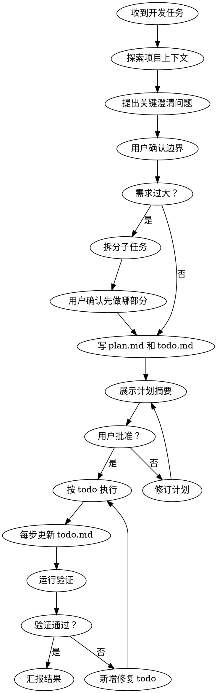

# Developemnt Plan

这个技能用于约束 AI 在写代码前先理解目标、反问用户、制定计划和待办，并在实现过程中持续维护项目内的 `plan.md` 与 `todo.md`。

<HARD-GATE>
如果当前运行环境是 Claude Code，执行本技能前不要自动切换到 Claude Code 的内置 plan mode；本技能自身负责通过反问、落盘 `plan.md` / `todo.md` 和用户批准来完成规划流程。

在完成以下动作之前，禁止写代码、改文件、安装依赖、运行迁移、生成脚手架或执行任何实现动作：

1. 探索项目上下文
2. 检查 `.developemnt-plan/` 中是否已有相同或相似主题的计划、待办或设计文档
3. 至少向用户提出 2-4 个必要澄清问题；理论上询问得越详细越好，复杂任务应继续追问直到需求清晰
4. 获得用户对实现边界和优先级的确认
5. 创建或更新项目内的计划文件和待办文件；如果已有相似计划，必须更新既有文件，不要重复创建
6. 向用户展示计划摘要并获得明确批准
</HARD-GATE>

## 适用场景

当用户要求你实现以下任一事项时，必须使用本技能：

- 实现一个产品、模块、页面、接口或功能
- 修改现有功能行为
- 修复非平凡 bug
- 重构代码结构
- 接入第三方服务、SDK、CLI 或 API
- 新增测试、构建流程、自动化流程
- 任何可能涉及多个步骤、多文件变更或需求取舍的开发任务

对于非常小的任务，例如修正一个明显拼写错误，可以不用完整流程；但只要存在需求不明确、实现方式选择或用户期望可能偏差，就必须使用本技能。

## 核心原则

- **先问再做**：不要假设用户真正想要什么；先确认目标、边界、成功标准和限制。
- **思维要扩散**：澄清和规划阶段不要只沿着用户字面需求线性推进，要主动发散思考可能的目标、用户场景、边界条件、隐含风险、替代方案、后续演进和容易遗漏的问题。
- **先定大方向，再刨根问底**：先确认技术栈、产品形态、核心用户、交付范围等大方向；一旦用户选择某个方向，就继续围绕该方向深入追问，直到这个方向内部形成闭环，再进入下一个大方向。例如用户选择 Next.js 后，要继续追问 App Router、渲染方式、数据层、认证、部署、UI 方案、API 边界等 Next.js 相关细节，而不是立刻跳到实现。
- **至少问 2-4 个问题**：制定计划前最少向用户提出 2-4 个澄清问题；理论上询问得越详细越好、越多越好，直到目标、边界、约束和验收标准足够清晰。
- **每问必带选项**：每个问题都必须给出 2-4 个清晰方案供用户选择，并标出推荐项。
- **不自动进入 Claude Code plan mode**：如果在 Claude Code 中使用本技能，不要主动切换到内置 plan mode；规划以本技能的文件化流程为准。
- **先查重再创建**：创建新计划、待办或设计文档前，必须先检查 `.developemnt-plan/` 中是否已有相同或相似主题；如果已有，更新既有文件，不要重复创建。
- **先计划后编码**：计划未落盘、未获批准之前，不进入实现。
- **待办必须同步**：每开始、完成或调整一个步骤，都要更新 `todo.md`。
- **计划必须可执行**：不要写空泛计划；每个步骤都应有明确产出和验证方式。
- **范围控制**：主动识别过大的需求，并建议拆分成可独立交付的小任务。
- **YAGNI**：不要添加用户未要求、计划未覆盖的功能。

## 落盘位置

默认将文件写入当前项目根目录下：

```text
.developemnt-plan/YYYY-MM-DD-<topic>/design.md
.developemnt-plan/YYYY-MM-DD-<topic>/plan.md
.developemnt-plan/YYYY-MM-DD-<topic>/todo.md
```

同一主题的 `design.md`、`plan.md` 和 `todo.md` 必须显示在同一个 `YYYY-MM-DD-<topic>` 文件夹中，便于查看和更新。

其中 `<topic>` 使用短横线命名，日期使用创建或更新该计划当天的 `YYYY-MM-DD`：

```text
.developemnt-plan/2026-05-14-image2-workbench/design.md
.developemnt-plan/2026-05-14-image2-workbench/plan.md
.developemnt-plan/2026-05-14-image2-workbench/todo.md
```

如果项目已有约定目录或用户指定了其他位置，优先遵循用户要求；否则使用上面的 `.developemnt-plan/` 路径。注意目录名按用户指定拼写为 `developemnt-plan`。

## 必须维护的文件

### `plan.md`

必须包含：

```markdown
# <任务名称> 实现计划

## 背景
- 用户要解决的问题是什么
- 当前项目相关上下文是什么

## 目标
- 本次要交付什么
- 用户可如何判断完成

## 非目标
- 本次明确不做什么

## 约束与假设
- 技术限制
- 产品限制
- 仍需用户确认的假设

## 方案
- 推荐方案
- 关键权衡
- 被排除的备选方案及原因

## 实施步骤
1. <步骤一>
2. <步骤二>
3. <步骤三>

## 验证方式
- 静态检查
- 单元测试 / 集成测试
- 手动验证路径

## 风险与回滚
- 主要风险
- 如何降低风险
- 如果失败如何恢复
```

### `todo.md`

必须包含可更新的 checklist：

```markdown
# <任务名称> Todo

## 状态说明
- `[ ]` 未开始
- `[~]` 进行中
- `[x]` 已完成
- `[!]` 阻塞或需要用户确认

## 待办
- [ ] 1. 探索项目上下文
- [ ] 2. 澄清需求并确认边界
- [ ] 3. 制定实现计划
- [ ] 4. 实施步骤一：<具体事项>
- [ ] 5. 实施步骤二：<具体事项>
- [ ] 6. 运行验证
- [ ] 7. 汇总结果和后续建议
```

## 标准流程

### 1. 探索上下文

先读取必要文件，了解：

- 项目结构
- 现有实现模式
- 相关配置
- 测试方式
- 是否已有计划、待办或开发约定
- `.developemnt-plan/` 下是否已有相同或相似主题的 `plan.md`、`todo.md` 或 design.md

不要为了探索而大范围读取无关文件。优先搜索与任务直接相关的入口、组件、接口、测试、文档和 `.developemnt-plan/` 中的既有计划。

### 2. 反问用户

在写计划前，至少确认以下内容中的关键不确定项：

- 用户真正想解决的问题是什么？
- 成功标准是什么？
- 目标用户或使用场景是什么？
- 是否有 UI、交互、性能、安全、兼容性或时间限制？
- 哪些内容本次不做？
- 对实现方案是否有偏好或禁忌？

制定计划前最少提出 2-4 个澄清问题；对于复杂任务，应继续追问更多问题，理论上询问得越详细越好、越多越好。可以围绕缺失信息、含糊不清的表述、需要补充的内容、范围边界、验收标准、技术限制、优先级、风险和用户偏好等任意有助于澄清的问题进行询问。每个问题都必须给出 2-4 个可选择方案，并附上推荐项；选项可以包含“用户输入 / 自定义输入 / 其他”这类由用户自行填写的选项；不要只抛开放式问题。

### 3. 识别范围

如果需求过大，先拆分，不要直接规划全部实现。

输出：

- 哪些部分可以独立交付
- 推荐先做哪一部分
- 为什么这个切分能降低风险

等待用户确认后，再继续制定该子任务的计划。

### 4. 制定并落盘计划

在用户确认需求边界后：

1. 检查 `.developemnt-plan/` 下是否已有相同或相似主题文件夹，以及其中的 `design.md`、`plan.md`、`todo.md`
2. 如果已有相似计划，更新既有 `YYYY-MM-DD-<topic>` 文件夹中的 `design.md`、`plan.md` 和 `todo.md`；不要创建重复主题文件夹
3. 如果没有相似计划，创建 `.developemnt-plan/YYYY-MM-DD-<topic>/`
4. 在该文件夹中创建 `design.md`
5. 在该文件夹中创建 `plan.md`
6. 在该文件夹中创建 `todo.md`
7. 在对话中简要展示计划摘要
8. 请求用户明确批准

批准前不得实现。

### 5. 执行时更新待办

实现阶段必须遵守：

- 开始某项工作前，把对应 todo 从 `[ ]` 改成 `[~]`
- 完成后立即改成 `[x]`
- 遇到阻塞改成 `[!]`，并写明阻塞原因
- 如果计划变化，同步更新 `plan.md` 和 `todo.md`
- 不要等全部做完后才一次性更新 todo

### 6. 验证与收尾

完成实现后：

1. 根据 `plan.md` 的验证方式运行检查
2. 将验证结果写入 `todo.md`
3. 如果验证失败，新增修复 todo，不要把任务标记完成
4. 最后向用户汇报：改了什么、验证结果、仍有哪些风险或后续事项

## 流程图



## 反模式

禁止以下行为：

- 用户刚说需求，就直接开始写代码
- 只在聊天里写计划，不把计划和 todo 落盘
- 创建计划前不检查既有 `.developemnt-plan/` 内容，导致重复计划或重复 todo
- 把同一主题的 plan、todo 和 design 分散到不同文件夹
- 创建 todo 后不更新
- 把需求不明确的问题留给实现时猜
- 为了显得高效跳过用户确认
- 未经确认扩大范围
- 计划写得太抽象，无法指导实现
- 验证失败仍然声称完成

## 对用户的推荐话术

当需要澄清时：

> 我先不直接写代码。为了避免实现偏离预期，我需要先确认一个关键点：<问题>？
>
> 方案：
> 1. <方案一>（推荐）：<原因>
> 2. <方案二>：<适用场景>
> 3. <方案三>：<取舍>
>
> 你希望选哪一个？

当计划已落盘时：

> 我已把计划和待办写入 `<plan-path>` 与 `<todo-path>`。摘要如下：<简短摘要>。请确认这个方向是否正确；你批准后我再开始实现。

当执行中更新 todo 时：

> 我已完成 `<步骤名>`，并同步更新了 `<todo-path>`。接下来会处理 `<下一步>`。

当遇到阻塞时：

> 当前阻塞在 `<阻塞点>`，我已在 `<todo-path>` 标记为 `[!]`。需要你确认：<一个具体问题>？

## 完成标准

只有同时满足以下条件，才能说任务完成：

- 计划文件存在且反映最终实现
- 待办文件存在且所有完成项已更新
- 代码或配置变更与计划一致
- 验证方式已执行或明确说明为何无法执行
- 未完成、跳过或失败的事项已清楚记录
